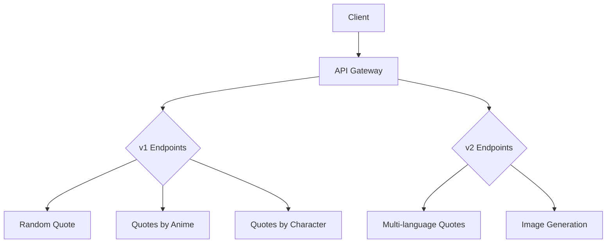
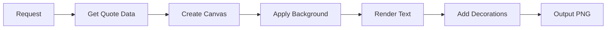
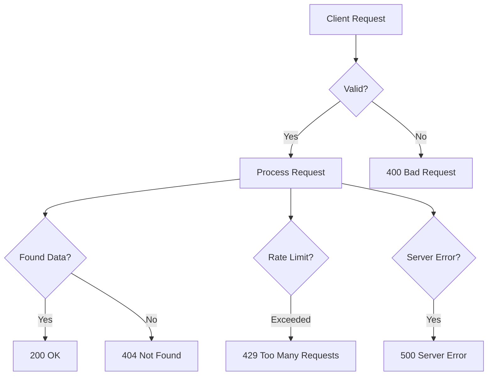

# AniQuotes API Documentation

## Table of Contents
1. [Overview](#overview)
2. [Base URL](#base-url)
3. [Authentication](#authentication)
4. [Rate Limiting](#rate-limiting)
5. [Response Format](#response-format)
6. [Endpoints](#endpoints)
   - [v1 Endpoints](#v1-endpoints)
   - [v2 Endpoints](#v2-endpoints)
7. [Image Generation](#image-generation)
8. [Examples](#examples)
9. [Error Handling](#error-handling)
10. [Contributing](#contributing)
11. [Support](#support)

## Overview <a name="overview"></a>
AniQuotes API provides anime quotes with multi-language support and image generation capabilities. The API is RESTful and returns JSON responses by default.



## Base URL <a name="base-url"></a>
```
https://aniquotesapi.vercel.app
```

## Authentication <a name="authentication"></a>
No authentication required for public endpoints. For future premium features, API keys will be used.

## Rate Limiting <a name="rate-limiting"></a>
- 100 requests per hour per IP address
- Exceeding limit returns HTTP 429
- Headers included in responses:
  ```
  X-RateLimit-Limit: 100
  X-RateLimit-Remaining: 99
  X-RateLimit-Reset: 3600
  ```

## Response Format <a name="response-format"></a>
All successful responses return JSON with this structure:
```json
{
  "data": {},
  "meta": {
    "count": 1,
    "credit": "GitHub/@Shineii86"
  }
}
```

## Endpoints <a name="endpoints"></a>

### v1 Endpoints <a name="v1-endpoints"></a>

#### `GET /v1/random`
Get a random anime quote

**Response:**
```json
{
  "data": {
    "id": 42,
    "quote": "Believe in the me that believes in you!",
    "anime": "Gurren Lagann",
    "character": "Kamina",
    "language": "en"
  },
  "meta": {
    "count": 1,
    "credit": "GitHub/@Shineii86"
  }
}
```

#### `GET /v1/anime?name=:anime_name`
Get quotes by anime title

**Parameters:**
| Name | Required | Description          |
|------|----------|----------------------|
| name | Yes      | Anime title          |

**Response:**
```json
{
  "data": [
    {
      "id": 42,
      "quote": "Believe in the me that believes in you!",
      "anime": "Gurren Lagann",
      "character": "Kamina",
      "language": "en"
    }
  ],
  "meta": {
    "count": 1,
    "credit": "GitHub/@Shineii86"
  }
}
```

#### `GET /v1/character?name=:character_name`
Get quotes by character name

**Parameters:**
| Name | Required | Description          |
|------|----------|----------------------|
| name | Yes      | Character name       |

### v2 Endpoints <a name="v2-endpoints"></a>

#### `GET /v2/languages?lang=:language_code`
Get quotes in specific languages

**Parameters:**
| Name   | Required | Description                        |
|--------|----------|------------------------------------|
| lang   | Yes      | Language code (en, jp, hi, etc.)   |
| anime  | No       | Filter by anime title              |
| character | No    | Filter by character name           |

**Response:**
```json
{
  "data": {
    "quotes": [
      {
        "id": 42,
        "quote": "お前を信じるお前を信じろ！",
        "anime": "天元突破グレンラガン",
        "character": "カミナ",
        "language": "jp"
      }
    ],
    "language": "jp"
  },
  "meta": {
    "count": 1,
    "credit": "GitHub/@Shineii86"
  }
}
```

#### `GET /v2/image?id=:quote_id&lang=:language_code`
Generate quote image

**Parameters:**
| Name | Required | Description               |
|------|----------|---------------------------|
| id   | Yes      | Quote ID                  |
| lang | No       | Language code (default: en) |

**Response:**
- PNG image with metadata:
  ```
  Content-Type: image/png
  Cache-Control: public, max-age=86400
  X-Quote-ID: 42
  X-Language: jp
  ```

## Image Generation <a name="image-generation"></a>


**Image Specifications:**
- Dimensions: 1200×630px (Social media optimized)
- Features:
  - Gradient background
  - Language-appropriate fonts
  - Text wrapping
  - Watermark
  - Decorative elements
  - Random anime-themed styling (30% chance)

## Examples <a name="examples"></a>

### cURL
```bash
# Get random quote
curl https://aniquotesapi.vercel.app/v1/random

# Get Naruto quotes in Japanese
curl "https://aniquotesapi.vercel.app/v2/languages?lang=jp&anime=Naruto"

# Generate quote image
curl "https://aniquotesapi.vercel.app/v2/image?id=56&lang=ru" -o quote.png
```

### JavaScript
```javascript
// Get random quote
fetch('https://aniquotesapi.vercel.app/v1/random')
  .then(response => response.json())
  .then(data => console.log(data));

// Generate and display quote image
const img = document.createElement('img');
img.src = 'https://aniquotesapi.vercel.app/v2/image?id=42';
document.body.appendChild(img);
```

### Python
```python
import requests

# Get quotes by character
response = requests.get(
  "https://aniquotesapi.vercel.app/v1/character",
  params={"name": "Lelouch"}
)
print(response.json())

# Save quote image
image = requests.get(
  "https://aniquotesapi.vercel.app/v2/image",
  params={"id": 56}
)
with open('quote.png', 'wb') as f:
    f.write(image.content)
```

## Error Handling <a name="error-handling"></a>


**Common Errors:**
```json
{
  "error": "Missing 'name' parameter",
  "credit": "GitHub/@Shineii86"
}
```

| Code | Meaning               | Resolution                     |
|------|-----------------------|--------------------------------|
| 400  | Bad Request           | Check parameters              |
| 404  | Not Found             | Verify quote/anime exists     |
| 429  | Too Many Requests     | Wait and retry later          |
| 500  | Server Error          | Report issue to support       |

## Contributing <a name="contributing"></a>
Add new quotes via GitHub pull requests:

1. **File Structure:**
   ```
   data/
   ├── quotes.json        # English quotes
   └── languages/
       ├── en.json        # English (optional)
       ├── jp.json        # Japanese translations
       └── hi.json        # Hindi translations
   ```

2. **Quote Format:**
   ```json
   {
     "id": 123,
     "quote": "Your quote here",
     "anime": "Anime Title",
     "character": "Character Name",
     "language": "en"
   }
   ```

3. **Rules:**
   - Maintain consistent ID across languages
   - Verify anime and character names
   - Use official translations where possible
   - Keep quotes authentic to source material

## Support <a name="support"></a>
- Email: aniquotesapi@gmail.com
- GitHub Issues: [AniQuotesAPI](https://github.com/Shineii86/AniQuotesAPI/issues)

---

<div align="center">
  
**[AniQuotes](https://github.com/AniQuotes)** For inquiries or collaborations
     
[](https://telegram.me/Shineii86 "Contact on Telegram")
[](https://instagram.com/ikx7.a "Follow on Instagram")
[](https://pinterest.com/ikx7a "Follow on Pinterest")
[](mailto:ikx7a@hotmail.com "Send an Email")

<sup>Maintained by [Shinei Nouzen](https://github.com/Shineii86) © 2025 AniQuotes - All Rights Reserved</sup>

</div>
